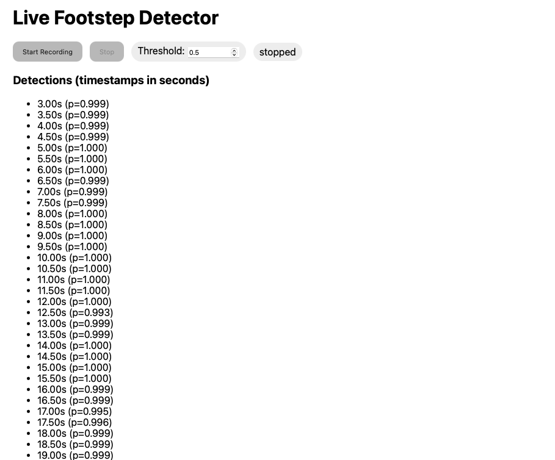

# Footstep Detection

This project explores detecting footsteps using a convolutional neural network (CNN) trained on a self-collected dataset.

## Dataset

The dataset was built over the course of a week by recording walking up and down the stairs and around the house. The recordings were segmented into 4-second clips and processed into log spectrograms for training. I also only viewed the spectrogram frequencies under the visible speaking range (< 200Hz).

## Model

- Convolutional Neural Network (CNN) with layers [64, 32, 32].
- Binary classification — _footstep_ vs _not footstep_.
- Achieved ~99% accuracy on held-out validation data.

## App

I built a small web application using HTML, JavaScript, and a FastAPI backend. The browser records audio through the microphone, streams it to the backend, and the trained CNN model makes predictions in real-time. The site then displays the timestamps where footsteps were detected.

## Limitations

- The model sometimes predicts pure silence as footsteps. This likely comes from insufficient training data that includes silent or near-silent conditions.

## Future Plans

- Expand dataset to include more examples of pure silence and background noise.
- Move beyond binary classification to identify **whose footsteps** are being detected
- Integrate into a live application that continuously records, processes, and outputs detections in real-time.
